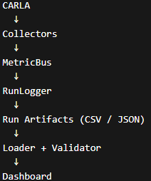
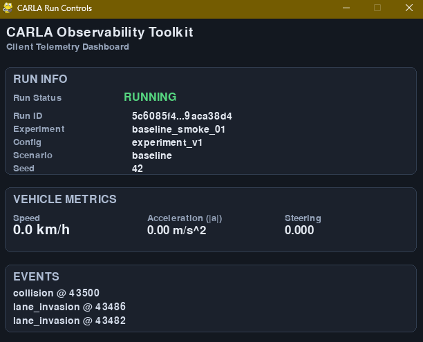
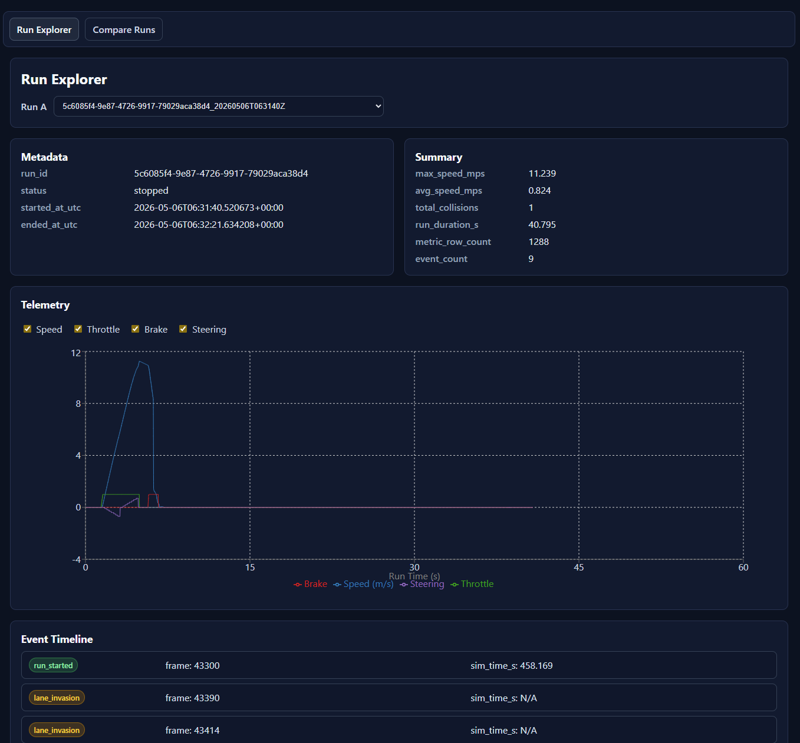
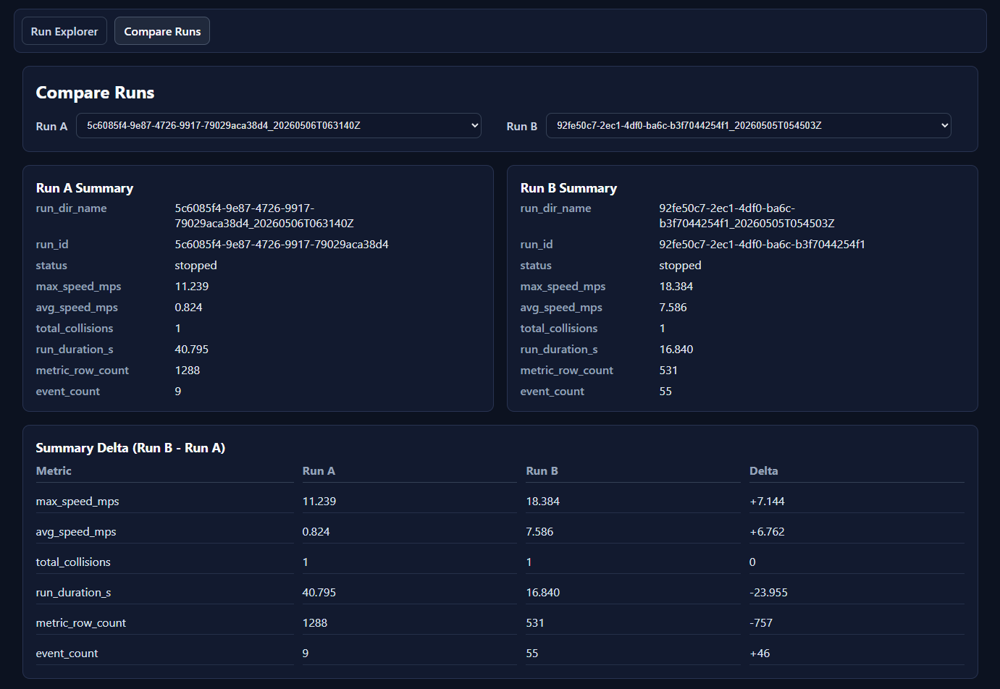
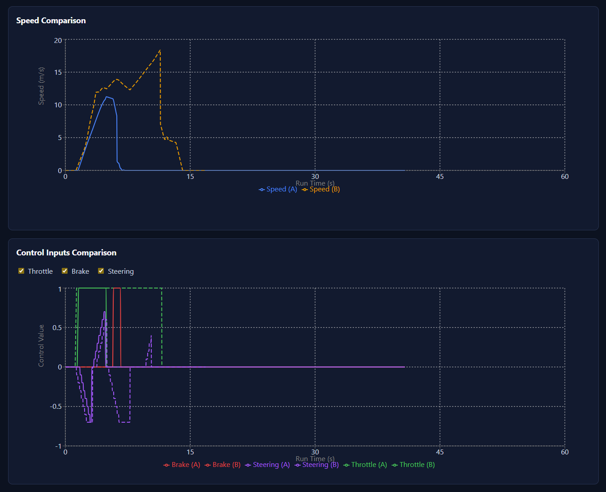

# CARLA Observability Toolkit

CARLA Observability Toolkit captures CARLA simulation telemetry as run-scoped datasets and provides a React dashboard for exploration and comparison. Each run is persisted as structured artifacts so results can be validated, analyzed, and reviewed consistently.

## Project Overview

- Run-centric observability pipeline for CARLA simulation sessions
- Structured artifacts per run (`metadata.json`, `metrics.csv`, `events.json`)
- Flask API for run listing and run-detail loading
- React dashboard UI for exploration and comparison

## Repository Layout

- `frontend/` - React + Vite dashboard source
- `backend/` - Flask API + React production host (`backend/app.py`)
- `src/cot/` - observability/runtime pipeline
- `scripts/` - validation and report utilities
- `runs/` - generated run artifacts

## Quick Start

Most common end-to-end demo flow:

1. Start CARLA server.
2. Run CARLA `manual_control.py`.
3. In another terminal, run:

```powershell
python src/cot/client/run_controls_smoke.py
```

4. Press `F5` to start capture, drive, then press `F6` to stop capture.
5. Build the frontend:

```powershell
cd frontend
npm run build
cd ..
```

6. Start the backend service:

```powershell
python backend/app.py
```

Open `http://127.0.0.1:5000`.

## Run-Centric Pipeline

Each simulation execution creates a self-contained run directory under `runs/`. These generated datasets are the source of truth for validation, summary statistics, and dashboard views.

## Architecture



### Observability Pipeline

Collectors publish telemetry and events through the bus, runtime components persist run artifacts, and the backend/API layer reads those artifacts for analysis and visualization. The pipeline is designed so raw run output and derived summaries stay aligned.

Current package/layout highlights:

- `src/cot/bus` - pub/sub and metric bus infrastructure
- `src/cot/carla` - CARLA-specific adapters and integration helpers
- `src/cot/collectors` - telemetry and event collectors
- `src/cot/config` - configuration models/loading
- `src/cot/runtime` - run loading, summaries, and runtime orchestration
- `backend/app.py` - Flask API + React build serving
- `frontend/` - React + Vite dashboard source

## Run Artifacts

Each run directory in `runs/` contains three primary artifacts:

- `metadata.json` - run identity, timing, and high-level run state
- `metrics.csv` - frame/time-series telemetry values for charting and analysis
- `events.json` - ordered run events (for example lifecycle and collision events)

## Reproducibility and Analysis

Run-scoped artifacts make experiments reproducible: the same inputs and outputs can be revisited later without rerunning CARLA. This also improves analysis quality by separating data collection from visualization, enabling consistent comparisons across runs and simplifying troubleshooting.

## Frontend and API Model

- Flask provides API endpoints:
  - `GET /api/runs`
  - `GET /api/runs/<run_dir_name>`
- API documentation: [`docs/API.md`](docs/API.md)
- React app is built from `frontend/` into `frontend/dist`.
- In single-server mode, Flask serves the built React app from `frontend/dist`.
- Legacy Flask/Chart.js dashboard is deprecated and available only as fallback at `/legacy`.

## Setup

### Python

```powershell
python -m venv .venv
.\.venv\Scripts\Activate.ps1
pip install -r requirements.txt
```

### Frontend

```powershell
cd frontend
npm install
npm run build
```

## Running Modes

### Development Mode

Terminal 1:

```powershell
python backend/app.py
```

Terminal 2:

```powershell
cd frontend
npm run dev
```

Open the Vite localhost URL shown in terminal output.

### Single-Server Demo Mode

```powershell
cd frontend
npm run build
cd ..
python backend/app.py
```

Open `http://127.0.0.1:5000`.

## Dashboard Features

- Run Explorer page
- Compare Runs page
- Summary stats
- Normalized telemetry charts
- Event timeline
- Side-by-side run comparison
- Speed and control comparison charts

## Dashboard Preview


Features shown:
- Telemetry visualization
- Event timeline
- Run metadata and summary statistics
- Normalized time-series charts

### Run Explorer


### Compare Runs



Features shown:
- Side-by-side run comparison
- Delta analysis
- Speed comparison charts
- Control input comparison charts

## Normalization

- Telemetry charts normalize simulation time per run so comparisons begin at t=0 regardless of CARLA world uptime.
## Testing

```powershell
python -m pytest -v
python -m compileall src scripts backend tests
```

Useful validation/report commands:

```powershell
python scripts/validate_run.py
python scripts/validate_runs.py
python scripts/validate_runs.py --last 3
python scripts/validate_runs.py --all
python scripts/generate_experiment_report.py <run_name>
```
[`docs/TestPlan.md`](docs/TestPlan.md)

## Demo Workflow

1. Install and use the official CARLA `0.10` release.
2. Start the CARLA server with `start_carla_dev.bat` (or equivalent low-resolution development settings).
3. Activate the virtual environment used for CARLA `PythonAPI/examples`.
4. Run `manual_control.py` to spawn/control a vehicle.
5. In a separate terminal, start the COT controls client:

```powershell
python src/cot/client/run_controls_smoke.py
```

6. Press `F5` to start run capture.
7. Drive the vehicle in `manual_control.py` to generate telemetry.
8. Press `F6` to stop run capture.
9. Validate the latest run artifacts:

```powershell
python scripts/validate_run.py
```

10. Build the frontend and start the backend service, then view results:

```powershell
cd frontend
npm run build
cd ..
python backend/app.py
```

Open `http://127.0.0.1:5000`.

Note: COT connects to CARLA over `localhost:2000` (default client settings: host `localhost`, port `2000`, timeout `10s`) and attaches to an existing active vehicle. The vehicle must exist and move to produce useful telemetry. `VehicleSpawner` is available for helper/spawn workflows, but the primary demo path currently uses `manual_control.py`.

## Tech Stack

- Python
- CARLA
- Flask
- React
- Vite
- Recharts
- JSON / CSV
- pytest
