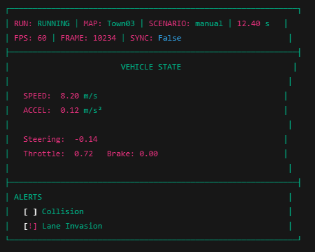

# Client Dashboard Wireframe v1

## Design Goals

- Real-time observability for ego vehicle
- Immediate awareness of motion state
- Clear alert visibility
- Minimal cognitive load

## Wireframe

## Section Breakdown

### Top Bar (Run Context)
- Run state
- Map
- Scenario type
- Simulation time
- Frame number
- FPS

### Vehicle State
- Acceleration
- Steering
- Throttle / Brake

### Alerts Panel
- Collision indicator
- Lane invasion indicator
- Visually isolated for priority

### Visual Priority Strategy
- Speed displayed largest
- Alerts color-coded (red = collision, yellow = lane invasion)
- Run state always visible
- Frame + FPS kept compact