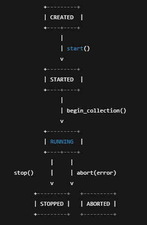

# CARLA Observability Toolkit — Run Model (v1)

Target: CARLA Python API 0.10.0
Purpose: Define the lifecycle and metadata for a “Run” (one simulation session) to support reproducible logging and analysis.

## 1) Run Lifecycle States
### States
- CREATED

Run object exists but has not connected to the simulator or begun sampling.
- STARTED

Run has initialized metadata and timestamps; connection to CARLA is confirmed.
- RUNNING

Metrics/events are actively being collected (per tick and/or per sensor callbacks).
- STOPPED

Run ended normally (explicit stop requested). End timestamp recorded.
- ABORTED

Run ended unexpectedly due to error, disconnect, exception, or forced termination. End timestamp recorded, plus abort reason.

Once a run enters STOPPED or ABORTED, its state MUST NOT change.
## 2) State Machine (ASCII Diagram)

### Transition Rules

- CREATED -> STARTED when:
  - run_id assigned
  - CARLA connection verified
  - initial metadata captured

- STARTED -> RUNNING when:
  - event collection begins (tick loop and/or sensor listeners attached)

- RUNNING -> STOPPED when:
  - graceful termination requested (user stop / planned end)
  - final snapshot taken (optional)
  - end timestamp recorded

- RUNNING -> ABORTED when:
  - exception, CARLA disconnect, timeout, or forced process stop occurs
  - abort reason recorded
- Terminal states: STOPPED and ABORTED (no outgoing transitions)

## 3) Required Run Metadata (v1)

### These fields MUST be captured for every run.
| Field                 | Type          | Description                                    | Source                 |
| --------------------- | ------------- | ---------------------------------------------- | ---------------------- |
| run_id                | string (UUID) | Unique run identifier                          | generated at creation  |
| schema_version        | string        | Must equal `"v1"`                              | constant               |
| state                 | enum          | One of CREATED/STARTED/RUNNING/STOPPED/ABORTED | run manager            |
| map_name              | string        | CARLA map name                                 | `world.get_map().name` |
| weather               | object        | Weather parameters (or preset label if used)   | `world.get_weather()`  |
| vehicle_blueprint     | string        | Ego vehicle blueprint id                       | blueprint `type_id`    |
| scenario_type         | enum          | `manual` | `autopilot` | `scripted`            | chosen by runner       |
| start_wall_time_utc_s | float         | Epoch seconds at run start                     | local time             |
| start_sim_time_s      | float         | Simulation elapsed seconds at start            | snapshot timestamp     |
| end_wall_time_utc_s   | float         | Epoch seconds at run end                       | local time             |
| end_sim_time_s        | float         | Simulation elapsed seconds at end              | snapshot timestamp     |
| duration_s            | float         | `end_* - start_*` (prefer sim)                 | computed               |

**run_id MUST be present in all metric rows and event rows to associate data with a specific run**.**

Duration rule: Prefer simulation duration (end_sim_time_s - start_sim_time_s) as canonical. Wall duration is optional diagnostic.

## 4) Optional Run Metadata (v1)

Useful but not required.

| Field             | Type      | Description                                                            |
| ----------------- | --------- | ---------------------------------------------------------------------- |
| tags              | object    | free-form metadata (e.g., `{ "purpose": "sprint1", "driver": "cam" }`) |
| notes             | string    | human-readable notes                                                   |
| tm_port           | int       | Traffic Manager port (if used)                                         |
| autopilot_enabled | bool      | whether autopilot was enabled during run                               |
| ego_actor_id      | int       | spawned vehicle actor id                                               |
| sensor_actor_ids  | list[int] | ids of attached sensors                                                |
| world_settings    | object    | sync mode, fixed dt, no_rendering                                      |
| abort_reason      | string    | only for ABORTED                                                       |

## 5) Extensibility Hooks (Future v2+)

### These are reserved ideas for later expansion without breaking v1.
- scenario_id (string): link to ScenarioRunner or scripted scenario definition
- route_id (string): link to recorded route or map path
- seed (int): RNG seed for reproducibility
- build_info (object): git commit hash, branch, build timestamp
- metrics_enabled (list[string]): allow per-run metric subset selection
- export_targets (list[string]): e.g., JSONL, CSV, Prometheus, etc

## 6) Implementation Notes (Non-binding)

- The Run lifecycle should be managed by a single “RunManager” component.
- State transitions should be atomic and logged as events:
  - run_started
  - run_stopped
  - run_aborted