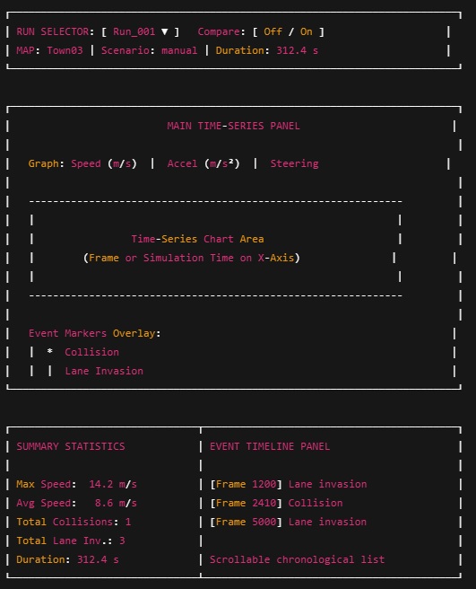

# Web Dashboard Wireframe v1
## Design Goals
- Analyze completed runs
- Compare performance across runs
- Overlay events on time-series data
- Separate run control from analysis

## Wireframe


## Layout Hierarchy
1. Run Control Layer (Top)
- Run selector dropdown
- Comparison toggle
- Run metadata header
This section controls context.

2. Analysis Layer (Middle)
- Primary time-series chart
- Event overlays on chart
- Multi-metric toggle (speed, accel, etc.)- 
This is the core analytical surface.

3. Summary + Timeline (Bottom)
Left: aggregated statistics
Right: event timeline (chronological)
Clear separation of:
- Aggregated metrics
- Discrete events

## Comparison Mode (Concept)

When “Compare: On”:

```
Graph overlays:
- Run_001 (blue)
- Run_002 (orange)

Summary panel splits:
| Run_001 | Run_002 |
| Max speed | Max speed |
| Avg speed | Avg speed |

```

### Design Principles
- Frame-aligned X-axis (simulation time primary, frame optional)
- Events represented as vertical markers
- Summary stats computed from canonical metric rows
- Scales to N runs via overlay or tabbed comparison